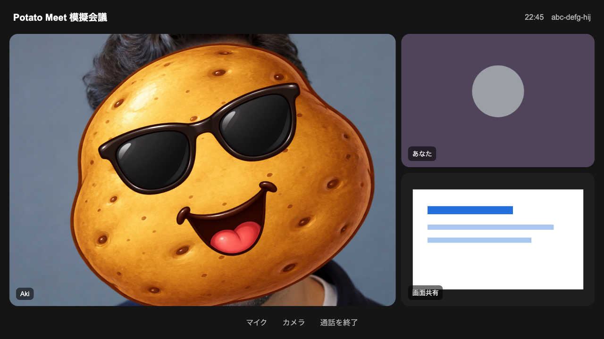

# Potato Meet

Google Meetで、相手の顔へ動くポテトを重ねるChrome拡張機能です。処理はブラウザ内で完結し、映像や顔情報を保存・送信しません。



## できること

- 自分と画面共有を除く、表示中の相手へポテトを表示
- じゃがいも、さつまいも、紫いもの3種類を選択
- つるのないサングラスを別レイヤーでON/OFF
- 口の開閉と顔の向きをポテトへ反映
- 参加人数に合わせて処理負荷を自動調整
- ポップアップで選択内容をすぐにプレビュー

## Chromeで使う

必要環境はNode.js 20以降とChrome 120以降です。

```bash
npm ci
npm run build
```

初回ビルド時だけ、MediaPipe公式配布元から顔検出モデルを取得してSHA-256を確認します。

1. Chromeで `chrome://extensions` を開きます。
2. 「デベロッパー モード」をONにします。
3. 「パッケージ化されていない拡張機能を読み込む」を押します。
4. このリポジトリの `dist` フォルダを選びます。
5. Google Meetを開き、Potato Meetの「ポテト表示」をONにします。

新しいMeetタブでは必ずOFFから始まります。

## 開発と確認

| コマンド | 内容 |
|---|---|
| `npm run check` | 型チェック、単体テスト、ビルド |
| `npm run test:browser` | Chromeへ拡張機能を読み込むブラウザ試験 |
| `npm run model` | 顔検出モデルの取得・SHA-256確認 |
| `npm run assets -- <画像パス>` | ポテト素材の切り出し |

実際のGoogle Meetでの顔向き、口の動き、長時間利用は手動で最終確認します。ブラウザ試験では実在人物ではない生成画像を使用します。

## フォルダ構成

```text
├── docs/       仕様、素材情報、画面例
├── licenses/   第三者ライセンス
├── public/     拡張機能へ同梱する画像とモデル配置先
├── scripts/    ビルドと素材準備
├── src/        拡張機能のソース
└── tests/      単体テストとブラウザ試験
```

- [現在の仕様](docs/spec.md)
- [画像素材](docs/assets.md)
- [第三者ソフトウェア](docs/third-party.md)

## プライバシー

- Chrome権限は `storage` だけです。
- 実行対象は `https://meet.google.com/*` だけです。
- マイク、カメラ、録画、閲覧履歴の権限は要求しません。
- CDN、分析ツール、遠隔ログを使用しません。
- 映像、顔画像、顔特徴量、参加者名、会議URLを保存しません。

## ライセンス

このリポジトリ自体には、現時点でオープンソースライセンスを設定していません。公開状態でも、第三者に再利用・再配布の許可を与えるものではありません。

`dist`と顔検出モデルはGitに含めません。公開配布用の拡張機能パッケージを作る場合は、[第三者ソフトウェア](docs/third-party.md)に記載した条件を改めて確認してください。
