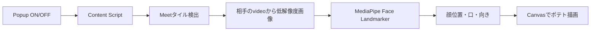

# Potato Meet（仮）MVP実装仕様書

**版:** MVP 0.1  
**作成日:** 2026-08-24  
**想定期間:** 5〜7開発日  
**成果物:** Chromeへ手動読み込みできる開発版

---

## 1. MVPで確かめること

MVPでは、次の体験だけを確かめる。

> Google Meetで相手の顔がポテトになり、相手が口を開くとポテトの口がぱくぱくし、顔を傾けたり左右へ向けたりするとポテトも同じ方向を向く。

この体験が実会議で成立し、「面白い」「また使いたい」と感じられるかを判断する。

前回作成したv1仕様は、個別指定、負荷制御、診断機能などを含むMVP後の仕様とする。

---

## 2. MVPの完成イメージ

```text
相手のカメラ映像
       ↓ ブラウザ内で顔を検出
┌────────────────────┐
│      🥔             │  顔の位置へポテトを表示
│     👀              │  左右を見ると目と口が移動
│     ◯               │  口を開くとポテトの口も開く
│  相手の名前           │  Meetの名前表示は残す
└────────────────────┘
```

MVPの「相手の映像がポテトになる」は、相手の**顔を完全に覆う大きさのポテトを重ねる**ことを意味する。背景、体、Meetの名前・操作表示は残す。人物全体の切り抜きや全身の置き換えは行わない。

---

## 3. 対象範囲

### 3.1 MVPに含める

| ID | 機能 | 必須の結果 |
|---|---|---|
| M-01 | 相手のカメラタイル検出 | 自分と画面共有を除外できる |
| M-02 | ポテト表示 | 相手の顔がポテトで隠れる |
| M-03 | 口の追従 | 相手の口に合わせて2段階で開閉する |
| M-04 | 顔の向きの追従 | 左右向きと首の傾きがポテトへ反映される |
| M-05 | タイル移動への追従 | Meetの表示位置が変わってもポテトが顔から外れない |
| M-06 | ON/OFF | 拡張機能のポップアップですぐ元へ戻せる |
| M-07 | 顔検出失敗時の表示 | エラーにならず静止ポテトへ切り替わる |

### 3.2 MVPに含めない

- 参加者ごとの個別指定
- 音声レベルの取得、発話者の判定
- カメラOFFの参加者への表示
- ショートカットキー
- まばたき、ランダムな揺れ、細かな表情
- キャラクター選択、追加キャラクター
- 設定の永続保存
- スクリーンショット、名前や社名のぼかし、SNS共有
- 課金、ログイン、Chrome Web Store公開
- 遠隔ログ、利用状況の分析
- Zoom、Teams、モバイル、Chrome以外のブラウザ

---

## 4. 利用の流れ

1. 利用者が開発版Chrome拡張を手動で読み込む。
2. Google Meetへ参加する。
3. Chromeの拡張機能アイコンからPotato Meetを開く。
4. 「ポテト表示」をONにする。
5. 自分以外のカメラ映像にポテトが表示される。
6. 相手の口と顔の向きにポテトが追従する。
7. 「ポテト表示」をOFFにすると、すぐ通常表示へ戻る。

新しいMeetタブでは必ずOFFから始める。現在のON/OFFはタブを閉じるまでメモリ内だけに保持する。

---

## 5. 機能仕様

### M-01 相手のカメラタイルを見つける

#### 要件

- `https://meet.google.com/*`だけで動作する。
- 表示中の`video`要素と、その親となるタイルを検出する。
- 次のタイルには何も表示しない。
  - 自分
  - 画面共有
  - 相手のカメラか判断できないタイル
- 最初の対象は、画面に表示中の相手カメラ最大4枚とする。
- 5枚以上ある場合、面積の大きい4枚だけを動くポテトにする。それ以外はMVPでは無加工とする。

#### 完成条件

- 1対1のMeetで、相手だけを検出できる。
- 自分の映像にはポテトが表示されない。
- 画面共有を開始しても、共有資料にはポテトが表示されない。
- 判定に失敗した場合、誤って表示するのではなく無加工になる。

### M-02 顔をポテトで覆う

#### 要件

- MediaPipe Face Landmarkerで、1映像につき最大1人の顔を検出する。
- ポテトの中心を顔の中心へ合わせる。
- ポテトは検出した顔の幅と高さの1.4倍を初期値とし、髪や顎を含めて隠す。
- ポテトの描画はタイル内に切り取る。
- Meetの名前、ミュート表示、操作ボタンは隠さない。
- Meetのvideo要素やタイルを削除・置換せず、Canvasで上から描画する。

#### 完成条件

- ONから2秒以内に相手の顔へポテトが表示される。
- 正面を向いた通常の距離で、顔の大部分が見えない。
- 相手がタイル内を動くと、500ms以内を目安にポテトも移動する。
- OFFから200ms以内を目安にCanvas描画が消える。

### M-03 口をぱくぱくさせる

#### 要件

- MediaPipeの`jawOpen`に相当する表情値を利用する。
- ポテトは次の2状態を持つ。
  - 口を閉じた状態
  - 口を開いた状態
- 開くしきい値と閉じるしきい値を分け、境界付近で細かく点滅しないようにする。
- 初期値は次とし、実映像を見て調整する。
  - `jawOpen >= 0.32`: 開く
  - `jawOpen <= 0.22`: 閉じる
- 音声は一切取得しない。ミュート中でも、映像上で口が動けば反応する。

#### 完成条件

- 相手が口を大きく開くと、ポテトの口も開く。
- 相手が口を閉じると、ポテトの口も閉じる。
- 通常の会話で、口の動きが500ms以内を目安に反映される。
- 無言で口を閉じている間、表示が細かく開閉し続けない。

### M-04 顔の向きをポテトへ反映する

MVPでは3Dモデルを使わず、1枚の2Dポテトを変形して向きを表現する。

| 顔の動き | ポテトの表現 |
|---|---|
| 首を左右へ傾ける | ポテト全体を同じ方向へ回転する |
| 顔を左・右へ向ける | 目と口を向いた側へ移動し、本体を少し横方向へ変形する |
| 顔を上・下へ向ける | 目と口を上下へ少し移動する |

#### 要件

- Face Landmarkerの顔変換行列、または顔特徴点から、次を求める。
  - `roll`: 首の左右の傾き
  - `yaw`: 左右を向く動き
  - `pitch`: 上下を向く動き
- 動きを次の範囲に制限する。
  - ポテト全体の回転: 左右最大25度
  - 目と口の左右移動: ポテト幅の最大10%
  - 目と口の上下移動: ポテト高さの最大6%
- 前回値と新しい値の間を補間し、細かな揺れを抑える。

#### 完成条件

- 相手が首を傾けると、ポテトも同じ方向へ傾く。
- 相手が左右を見ると、ポテトが向きを変えたように見える。
- 正面で静止しているとき、ポテトが細かく震え続けない。
- 動きが大きいときも、ポテトが逆方向を向かない。

### M-05 Meetの表示変更へ追従する

#### 要件

- `MutationObserver`でタイルの追加と削除を監視する。
- `ResizeObserver`または定期的な位置確認でタイルの位置と大きさを更新する。
- DOMイベントを短時間にまとめ、イベントごとに全画面を調べない。
- 参加者が退出したら、その人の検出状態を破棄する。

#### 完成条件

- 1対1とグリッド表示の切り替え後、1秒以内を目安に位置が合う。
- ウィンドウサイズを変えてもポテトが元の位置へ残らない。
- 参加者が退出した後、ポテトだけが画面に残らない。

### M-06 ON/OFF

#### 要件

ポップアップには次だけを表示する。

```text
Potato Meet
[ ON / OFF ] ポテト表示

映像は保存・送信されません
```

- Meet以外では「Google Meetを開くと使えます」と表示する。
- OFF中は顔検出とCanvas描画を停止する。
- ON/OFF状態は現在のMeetタブだけに適用する。

#### 完成条件

- スイッチ操作が現在のMeetタブへ反映される。
- OFF後に顔検出が動き続けない。
- ON/OFFを10回繰り返してもCanvasや監視処理が増殖しない。

### M-07 顔が見つからない場合

#### 要件

- 顔を500ms以内だけ見失った場合、最後の位置を保持する。
- 500msを超えた場合、ポテトをタイル中央へ移動して静止させる。
- 顔を連続2回検出できたら追従へ戻す。
- `video`から画像を取得できない場合、そのタイルは無加工にする。

#### 完成条件

- 後ろを向く、顔を手で隠す、画面外へ移動してもエラーにならない。
- 顔が戻ると、2秒以内を目安に追従が再開する。
- カメラOFFのタイルには、MVPではポテトを表示しない。

---

## 6. 必要なポテト素材

MVPでは1キャラクターだけを使用する。

| 素材 | 内容 |
|---|---|
| `potato-body.png` | 目と口を含まないポテト本体。透過PNG |
| `eyes.png` | 通常の目。透過PNG |
| `mouth-closed.png` | 閉じた口。透過PNG |
| `mouth-open.png` | 開いた口。透過PNG |

本体、目、口を別レイヤーで描画する。顔の向きに応じて目と口だけを移動できるため、左右向き用の画像を増やさずにMVPを作れる。

既存キャラクターや実在人物に似せず、すべて自作または生成AIで作成した独自素材を使う。

---

## 7. 実装構成



### 7.1 Chrome拡張

```text
potato-meet/
├─ manifest.json
├─ src/
│  ├─ content.ts          # タイル検出、顔検出の制御、描画
│  ├─ meet-adapter.ts     # Meet依存のセレクタと判定
│  ├─ face-tracker.ts     # MediaPipeの呼び出し
│  ├─ renderer.ts         # Canvas描画
│  ├─ geometry.ts         # 顔座標とタイル座標の変換
│  └─ popup/
│     ├─ popup.html
│     ├─ popup.ts
│     └─ popup.css
├─ public/
│  ├─ mediapipe/          # WASM
│  ├─ models/             # Face Landmarkerモデル
│  └─ potato/             # ポテト画像
└─ tests/
   ├─ geometry.test.ts
   └─ mock-meet.html
```

### 7.2 顔検出

- `@mediapipe/tasks-vision`をローカルへ同梱する。
- `outputFaceBlendshapes: true`で口開閉値を取得する。
- `outputFacialTransformationMatrixes: true`で顔の向きを取得する。
- 入力画像の長辺は256pxを初期値とする。
- 1つのFace Landmarkerを参加者間で順番に使用する。
- 1人あたり平均3〜5fpsを目標とする。
- 古い未処理フレームは捨て、常に最新に近い映像を処理する。

MediaPipe処理は同期的に画面を止める可能性がある。最初は1人の低頻度処理で成立を確認し、1回の検出が25msを継続して超える場合、またはMeet操作に引っかかりが出る場合は、専用Workerへの分離をMVP完成条件に追加する。

### 7.3 描画

- 画面全体に固定した透過Canvasを1枚だけ追加する。
- Canvasは`pointer-events: none`とする。
- `requestAnimationFrame`は描画だけに利用する。
- DOM探索とMediaPipe処理を描画ループ内で毎回実行しない。
- `devicePixelRatio`は最大2として、過剰な描画負荷を避ける。

---

## 8. 権限とプライバシー

### 必要な権限

- `https://meet.google.com/*`でのContent Script実行

### 要求しない権限

- マイク
- カメラ
- タブ録画、画面録画
- すべてのWebサイトへのアクセス
- 閲覧履歴
- 外部サーバーへのアクセス

### データの扱い

- 映像はブラウザのメモリ内だけで処理する。
- 映像、顔画像、顔特徴量、名前、会議URLを保存しない。
- 音声を取得しない。
- CDN、分析ツール、遠隔ログを使わない。
- MediaPipeのJavaScript、WASM、モデルを拡張機能内へ同梱する。

---

## 9. MVPの性能目標

| 条件 | 目標 |
|---|---|
| 主な試験条件 | 1対1のMeet |
| 簡易確認条件 | 相手3人までの4人Meet |
| 初回表示 | ONから2秒以内 |
| 口と向きの反映 | 500ms以内を目安 |
| 顔検出 | 1人あたり平均3〜5fps |
| ON/OFF | 200ms以内を目安 |
| 連続利用 | 15分で停止しない |

MVPでは厳密なCPU使用率の保証は行わない。ただし、Meetの音声が途切れる、ボタン操作が継続的に重くなる、映像が数秒止まる状態は完成扱いにしない。

---

## 10. テスト項目

### 10.1 必須試験

| 試験 | 成功条件 |
|---|---|
| 1対1・正面 | 相手だけがポテトになる |
| 口を開閉 | ポテトの口がぱくぱくする |
| 首を左右に傾ける | ポテトが同じ方向へ傾く |
| 顔を左右へ向ける | ポテトの目と口が向いた側へ動く |
| 顔を隠して戻す | 静止表示を経て追従が再開する |
| ウィンドウサイズ変更 | ポテトが顔の近くへ追従する |
| 画面共有 | 資料にポテトが表示されない |
| ON/OFFを10回 | 重複表示やエラーがない |
| 15分連続利用 | 停止や目立つ操作遅延がない |
| Network確認 | 拡張機能から外部通信がない |

### 10.2 簡易試験

- 4人Meetで相手3人へ表示できる。
- 参加者が入退室しても、ポテトだけが残らない。
- グリッドとピン留めを切り替えても大きく位置がずれ続けない。

---

## 11. MVP完成条件

以下をすべて満たしたらMVP完成とする。

- 1対1の実Meetで、相手の顔がポテトに置き換わる。
- 相手の口開閉に合わせて、ポテトの口がぱくぱくする。
- 首の傾きと左右向きがポテトへ反映される。
- 自分と画面共有には表示されない。
- 顔を見失っても壊れず、顔が戻ると追従を再開する。
- ポップアップから確実にON/OFFできる。
- 15分の会議でMeetの利用を妨げる問題がない。
- 映像・音声の保存と外部通信がない。
- Chromeへ手動読み込みできるビルド成果物と短い導入手順がある。

個別指定、ショートカット、発話者検出、長時間・多人数向けの負荷制御は、MVP完成後にv1として追加する。

---

## 12. 5〜7日の実装順

| 日 | 作業 | その日の完成状態 |
|---:|---|---|
| 1 | Manifest、ポップアップ、模擬Meet、Canvas | ONで模擬タイルへポテトを表示できる |
| 2 | 実Meetのタイル検出、自分・共有の除外 | 1対1で相手だけに静止ポテトが出る |
| 3 | MediaPipeローカル実行、顔位置追従 | ポテトが顔の位置と大きさへ追従する |
| 4 | `jawOpen`、口の2状態 | 口がぱくぱくする |
| 5 | 顔の向き、平滑化 | 傾きと左右向きが自然に見える |
| 6 | 表示変更追従、失敗時処理、4人簡易試験 | 入退室・サイズ変更で壊れない |
| 7 | 15分実Meet、負荷修正、ビルド手順 | MVP完成条件を確認できる |

### 最初に通す技術確認

実装開始後、次の順番で確認する。

1. 実Meetの相手`video`要素を読める。
2. その映像をMediaPipeへ入力できる。
3. `jawOpen`と顔の向きを取得できる。
4. 取得値をCanvasのポテトへ反映できる。

2または3が成立しない場合は、UIや追加機能を作らず原因調査を優先する。

