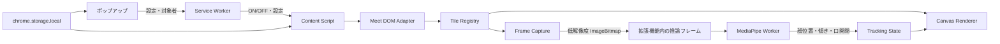

# Potato Meet（仮）v1 実装仕様書

> **位置づけ:** この文書はMVP完成後のv1仕様である。最初に実装する範囲は[product-spec-mvp.md](./product-spec-mvp.md)を参照する。

**版:** v1.0  
**作成日:** 2026-08-24  
**対象期間:** 2〜3週間  
**対象成果物:** Chromeに手動で読み込める、日常利用可能なv1開発版  
**対象ブラウザ:** デスクトップ版Google Chrome Stable / Manifest V3  
**対象サービス:** ブラウザ版Google Meet（`https://meet.google.com/*`）

---

## 1. この仕様書の目的

この文書は、アイデア段階の要件を、実装、テスト、完成判定まで行える要件へ作り直したものである。

v1の目的は、次の体験を安定して成立させることに絞る。

> Google Meetに表示される自分以外の参加者の顔を、自分の画面上だけでジャガイモに置き換える。参加者が話すと口が動き、画面の変化や参加者の入退室にも追従する。

Chrome Web Store公開、課金、共有用スクリーンショット、追加キャラクターはv1に含めない。

---

## 2. プロダクトの定義

### 2.1 コンセプト

> **「会議が、たえられる。」**

会議の内容や相手の映像を変更せず、利用者のブラウザ上の表示だけを楽しくする。

### 2.2 想定利用者

| 利用者 | 利用場面 | 得たい結果 |
|---|---|---|
| 会議の多い会社員 | 長い定例、全社会議 | 顔から受ける圧迫感を軽くしたい |
| リモートワーカー | カメラONの1on1、報告会 | 緊張を少し和らげたい |
| 開発者本人 | 毎日の実会議 | 壊れ方と面白さを早く検証したい |

### 2.3 v1の価値

- 相手側の画面や配信映像には一切影響しない。
- 映像の処理はブラウザ内で完結する。
- 録画、録音、画像保存、外部送信を行わない。
- ショートカットですぐに元の表示へ戻せる。

### 2.4 用語

| 用語 | この文書での意味 |
|---|---|
| タイル | Meet上で参加者または画面共有を表示する領域 |
| カメラタイル | 参加者のカメラ映像またはカメラOFF画像を表示するタイル |
| 共有タイル | 画面共有、資料、動画の共有を表示するタイル |
| オーバーレイ | Meetの表示を変更せず、その上に重ねる描画 |
| 追従表示 | 顔の位置、大きさ、傾き、口の開閉に合わせた描画 |
| 静的表示 | 顔を検出できない場合に中央へ表示する動かないジャガイモ |

---

## 3. v1の範囲

### 3.1 v1に含める

| ID | 機能 | 優先度 |
|---|---|---:|
| F-01 | Meetの対象タイルを検出し、ジャガイモを重ねる | 必須 |
| F-02 | 発話または口の動きに反応して、口と体を動かす | 必須 |
| F-03 | ポップアップとキーボードで即座にON/OFFする | 必須 |
| F-04 | 参加者の入退室、並べ替え、表示変更へ追従する | 必須 |
| F-05 | 顔の位置、大きさ、傾き、口の開閉へ追従する | 必須 |
| F-06 | 全員または選んだ参加者だけを対象にする | 必須 |
| F-07 | 顔検出不能、カメラOFF、処理過負荷時に安全に代替表示する | 必須 |
| F-08 | 壊れた原因を確認できる開発者向け診断表示を備える | 必須 |

### 3.2 v1に含めない

- 自分の送信映像の加工
- Zoom、Microsoft Teams、Meet以外のWeb会議
- 録画、録音、会議内容の保存
- スクリーンショット作成とSNS共有
- 名前、社名、字幕の自動ぼかし
- キャラクターパック、課金、ログイン、ライセンス確認
- 利用状況の分析、遠隔ログ送信、広告
- Chrome Web Storeへの公開作業
- モバイル、Firefox、Safari、Edgeの正式対応

---

## 4. 元仕様から変更した重要事項

| 項目 | 元仕様 | v1での決定 | 理由 |
|---|---|---|---|
| 発話検出 | 参加者別の音声レベルをWeb Audio APIで取得 | Meet上の発話表示を優先し、顔が見える場合は口の開閉も使う | Meetが参加者ごとの音声を個別の公開インターフェースとして提供する保証がないため |
| 音声権限 | 未確定 | マイク、録音、タブ音声取得の権限を要求しない | 信頼性とストア審査上の説明を簡単にするため |
| 顔検出 | 描画処理と同じ場所で実行 | 専用の処理スレッドで実行 | MediaPipeの顔検出は同期処理であり、画面側で実行するとMeetの操作を止める可能性があるため |
| 顔検出方式 | 各映像を常時処理 | 低解像度、低頻度、順番処理。描画だけ最大60fps | 4人会議での負荷を抑えるため |
| 個別割り当て | 保存方法が未定 | 会議中だけ保持し、名前を永続保存しない | 同名参加者やDOM変更への誤動作と個人情報保存を避けるため |
| セレクタ外部化 | 外部ファイル化 | 拡張機能内の版管理された設定ファイルに分離 | 遠隔取得をせず、v1の「外部通信なし」を守るため |
| 共有タイル | 対象外 | 判定が不確かな場合も変換しない | 資料を隠す誤動作の方が影響が大きいため |
| 完成条件 | 「体感遅延なし」 | 測定条件と数値を定義 | 完成かどうかを判断できるようにするため |

### 4.1 F-02の表現上の注意

v1は「参加者別の音声レベルを解析する」とは説明しない。実装は次の順で反応源を選ぶ。

1. 顔が検出できる場合: MediaPipeの口開閉値を使う。
2. Meet上で発話中を示す表示が取得できる場合: 発話中の体の揺れに使う。
3. どちらも取得できない場合: 静的表示または小さな待機動作にする。

カメラOFFの参加者に対する発話反応は、Meetの画面構造から発話状態を取得できる場合だけ提供する。

---

## 5. 利用の流れ

### 5.1 初回利用

1. 利用者が拡張機能をインストールまたは手動読み込みする。
2. Meetへ参加する。
3. ツールバーの拡張機能アイコンを開く。
4. 「ジャガイモ表示」をONにする。
5. 自分と画面共有を除く参加者へジャガイモが表示される。
6. ポップアップまたはショートカットでOFFにすると、即座に元の表示へ戻る。

### 5.2 個別指定

1. ポップアップで「選んだ人だけ」を選ぶ。
2. 現在検出できている参加者一覧から対象を選ぶ。
3. 選択した参加者だけがジャガイモになる。
4. 選択内容はそのMeetタブを閉じるか再読み込みすると消える。

### 5.3 異常時

- タイルを正しく分類できない場合、そのタイルには何も重ねない。
- 顔を見失った場合、最後の位置を短時間保持した後、中央の静的表示へ切り替える。
- 処理負荷が高い場合、顔検出回数を減らす。それでも高い場合は静的表示へ切り替える。
- 拡張機能内でエラーが発生しても、Meetの映像、音声、ボタン操作を妨げない。

---

## 6. 画面仕様

### 6.1 ポップアップ

幅は約320pxとし、次の状態を表示する。

| 状態 | 表示内容 |
|---|---|
| Meet以外のページ | 「Google Meetを開くと使えます」 |
| Meetの待機画面 | ON/OFF、プライバシー説明、ショートカット |
| Meet参加中 | ON/OFF、対象モード、参加者一覧、状態表示 |
| 拡張機能がMeet構造を読めない | 「現在のMeet表示に対応できません」、再試行、診断情報 |

#### 表示項目

- 主スイッチ: 「ジャガイモ表示」
- 対象:
  - 「自分以外の全員」
  - 「選んだ人だけ」
- 参加者一覧:
  - 表示名
  - 選択チェック
  - 「自分」「画面共有」「判定不能」の状態
- 短い説明: 「映像は保存・送信されません」
- ショートカット表示
- 開発版のみ: 診断表示のON/OFF

### 6.2 Meet上の表示

- ジャガイモは参加者の顔を十分に隠す大きさにする。
- 名前、ミュート表示、Meetの操作ボタン、字幕を隠さない。
- 描画領域は各タイルの内側で切り取る。
- オーバーレイ全体に `pointer-events: none` を設定し、Meetのクリック操作を妨げない。
- ON/OFF時は右上に約1.5秒だけ状態通知を表示する。
- 自分のタイルと共有タイルには何も表示しない。

### 6.3 動き

| 状態 | 動き |
|---|---|
| 待機 | 0.8〜1.5%の小さな呼吸動作。3〜7秒間隔でまばたき |
| 発話 | 口を開閉し、体を最大3%の範囲で小さく上下させる |
| 顔の傾き | 顔の傾きへ追従。ただし表示角度は左右25度まで |
| 顔を一時的に見失う | 0.5秒まで最後の状態を保持 |
| 顔を継続して見失う | 1.2秒以内に静的表示へ切り替える |

`prefers-reduced-motion: reduce` が有効な環境では、待機中の呼吸と揺れを止める。口の開閉は2段階の切り替えに簡略化する。

---

## 7. 機能要件と受け入れ条件

### F-01 タイル検出とジャガイモ表示

**要件**

- 表示中のタイル候補を検出する。
- 各候補を「相手のカメラ」「カメラOFF」「自分」「画面共有」「判定不能」に分類する。
- 対象タイルの上へ、1枚の透過Canvasを使ってジャガイモを描画する。
- Meet本体のDOMや映像要素の削除、非表示、置換は行わない。

**受け入れ条件**

- 拡張機能をONにしてから1秒以内に、表示中の対象タイルへ描画される。
- 自分のタイル、画面共有、判定不能のタイルは変更されない。
- 名前、字幕、操作ボタンが読めて操作できる。
- OFFにしてから200ms以内に全描画が消える。
- ON/OFFを10回繰り返してもCanvasや監視処理が重複しない。

### F-02 発話・口開閉への反応

**要件**

- 顔を検出できる参加者では、MediaPipeの口開閉値をジャガイモの口へ反映する。
- Meet上の発話表示が取得できる場合は、発話中の体の動きにも反映する。
- 短時間の検出ぶれで口が点滅しないよう、開始と終了で異なるしきい値を使う。
- 音声そのものは取得、保存、送信しない。

**受け入れ条件**

- 顔が正面に見える通常の会話で、発話開始から500ms以内に口が動き始める。
- 無言状態で口が細かく点滅し続けない。
- 口開閉値が取得できない場合でも例外を発生させず、待機表示を続ける。
- Chromeのマイク、タブ録音、音声取得権限を要求しない。

### F-03 ON/OFF

**要件**

- ポップアップの主スイッチで切り替える。
- `chrome.commands` でタブ単位の切り替えを行う。
- 初期候補キーは `Alt+Shift+P` とし、利用者は `chrome://extensions/shortcuts` から変更できる。
- 初期候補キーが他の拡張機能と競合して未設定になった場合、ポップアップに再設定案内を表示する。
- 新しく開いたMeetタブでは初期状態をOFFとする。

**受け入れ条件**

- Chromeにフォーカスがある状態で、キー入力から200ms以内に表示が切り替わる。
- Meetのテキスト入力欄に文字を入力していても、設定した拡張機能コマンドとして動作する。
- ショートカットが未設定の場合、ポップアップから`chrome://extensions/shortcuts`の案内を確認できる。
- OFF中は顔フレームの取得と顔検出を停止する。
- 切り替えによってMeetのマイク、カメラ、退出状態が変化しない。

### F-04 入退室とレイアウト変更への追従

**要件**

- `MutationObserver` でDOMの追加、削除、属性変更を監視する。
- `ResizeObserver` と定期照合でタイル位置と大きさを更新する。
- 参加者識別子は、取得できるものを次の順で使う。
  1. Meet DOM上の参加者識別子
  2. 映像トラックのセッション内ID
  3. 表示名と同名順序を組み合わせた一時識別子
- 監視イベントごとに全DOMを走査せず、短時間にまとめて照合する。

**受け入れ条件**

- 参加者の入退室、ピン留め、グリッド変更後1秒以内に位置が合う。
- タイルの移動中にジャガイモが別の参加者へ残り続けない。
- 削除されたタイルの状態と画像を2秒以内に解放する。
- 同じ表示名の参加者が2人いても、映像トラックIDを取得できる限り個別に扱える。

### F-05 顔追従

**要件**

- MediaPipe Face Landmarkerを拡張機能へ同梱し、外部配信サービスから読み込まない。
- 1タイルにつき最大1人の顔を検出する。
- 顔の中心、大きさ、左右の傾き、口開閉値を返す。
- 1つのモデルを全タイルで共有し、低解像度フレームを順番に処理する。
- 参加者ごとに前回値を保持し、位置と角度をなめらかにする。

**受け入れ条件**

- 4人表示時、各参加者を平均3fps以上で検出する標準設定を目標とする。
- 描画は前回の検出結果を使い、最大60fpsで更新できる。
- 顔がタイル内を動いたとき、通常条件では500ms以内に表示位置が追従する。
- 首を傾けたとき、ジャガイモも同じ方向へ傾く。
- 口を開閉したとき、口の表示が追従する。
- 顔検出処理がMeet画面の主処理を直接長時間止めない。

### F-06 対象者の個別選択

**要件**

- 「自分以外の全員」と「選んだ人だけ」の2モードを提供する。
- 参加者一覧は、現在のMeetタブから取得する。
- 個別選択はそのタブのメモリだけに保存する。
- 表示名や顔画像を `chrome.storage`、ファイル、外部サービスへ保存しない。

**受け入れ条件**

- モード変更と選択結果が500ms以内にMeet上へ反映される。
- 参加者が入室または退室すると、一覧が2秒以内に更新される。
- タブの再読み込み後、個別選択が残らない。
- 自分と画面共有は選択対象にできない。

### F-07 代替表示と負荷制御

**要件**

- 次の場合はタイル中央に静的ジャガイモを表示する。
  - カメラOFF
  - 顔が1.2秒以上見つからない
  - フレーム取得ができない
  - 自動負荷制御がそのタイルの顔検出を停止した
- 自分、共有、判定不能は静的表示の対象にも含めない。
- 顔を連続2回検出できたら追従表示へ戻す。
- 処理が追いつかない場合、古いフレームを捨てて最新フレームだけを処理する。

**受け入れ条件**

- 後ろ姿、顔の遮蔽、カメラOFFでもエラー表示にならない。
- カメラ復帰後、通常条件で2秒以内に追従表示へ戻る。
- 7人以上の対象者がいる場合、優先度の低いタイルを静的表示にできる。
- 過負荷時にもMeetの音声、映像、操作を優先する。

### F-08 診断表示

**要件**

- 開発版のポップアップから診断表示を有効にできる。
- 各タイルに次を表示できる。
  - 一時識別子
  - 分類結果
  - 顔検出の有無
  - 最終検出時刻
  - 検出頻度
- 個人名、映像、音声を診断ファイルへ出力しない。
- 通常利用時は診断表示を完全に隠す。

**受け入れ条件**

- DOM変更で動作しない場合、「タイル未検出」「分類不能」「映像取得失敗」「顔検出失敗」を区別できる。
- 診断をOFFにすると、診断用の文字や枠が画面に残らない。

---

## 8. システム構成



### 8.1 構成要素

| 構成要素 | 責務 | 禁止事項 |
|---|---|---|
| Service Worker | ショートカット、ポップアップとタブの通信 | 映像処理、長期状態の保持 |
| Content Script | Meet DOM監視、タイル管理、Canvas描画 | Meet内部変数への直接依存 |
| Meet DOM Adapter | セレクタと分類ルールを1か所へ集約 | UI、MediaPipe処理 |
| Tile Registry | タイルID、分類、位置、選択状態を管理 | DOM全体の常時走査 |
| Frame Capture | 対象映像から低解像度画像を作る | フレームの保存、外部送信 |
| Inference Frame | 拡張機能の実行環境とWorkerをつなぐ | 個人情報の保存 |
| MediaPipe Worker | 顔検出、特徴値算出 | DOM操作、ネットワーク通信 |
| Canvas Renderer | 最新状態を使った描画 | 画像解析 |
| Popup | ON/OFF、対象選択、状態表示 | 顔画像の表示、保存 |

### 8.2 顔検出の処理

1. Content Scriptが対象の`video`から低解像度の`ImageBitmap`を作る。
2. 画像を拡張機能内の推論フレーム経由でWorkerへ渡す。
3. Workerは待ち行列を参加者ごとに1件まで保持する。
4. 新しい画像が届いた場合、同じ参加者の古い未処理画像を捨てる。
5. 1つのFace Landmarkerを`IMAGE`モードで全参加者に順番利用する。
6. 478点すべてを画面側へ返さず、次の値へ縮約して返す。
   - 顔の中心 `x, y`
   - 顔の幅、高さ
   - 左右の傾き
   - 口開閉値
   - 検出信頼度
7. Content Scriptは前回値との間を補間し、Canvasへ描画する。

複数参加者の別々の映像を1つの`VIDEO`追跡状態へ交互に入れない。参加者間で追跡状態が混ざるのを避けるため、共有モデルの`IMAGE`モードと利用者ごとの平滑化を採用する。

### 8.3 映像座標から画面座標への変換

Meetの映像はタイル内で`object-fit: cover`相当の切り取りが行われる場合がある。顔検出結果を単純にタイル幅へ掛けず、次を考慮する。

- 映像の元の幅と高さ
- タイルの表示幅と高さ
- 上下または左右の切り取り量
- 自分映像の左右反転。ただしv1では自分を対象外とする
- タイル下部の名前表示用安全領域

座標変換は純粋な計算関数として分離し、単体テストを行う。

### 8.4 描画方法

- `document.documentElement`直下へ専用ホストを1つ追加する。
- ホスト内はShadow DOMにし、MeetのCSSとの衝突を避ける。
- 画面全体に固定した透過Canvasを1枚使う。
- Canvasの内部解像度は`devicePixelRatio`に合わせる。ただし上限2とする。
- 各タイルの矩形で切り取り、ジャガイモを描画する。
- `requestAnimationFrame`は描画だけに使い、DOM探索や顔検出を行わない。

---

## 9. Meet DOMへの対応方針

Google Meetの内部DOMは公開インターフェースではないため、特定のクラス名へ処理を直接埋め込まない。

### 9.1 Adapterの出力

```ts
type TileKind = "remote-camera" | "camera-off" | "self" | "presentation" | "unknown";

type TileSnapshot = {
  tileId: string;
  participantKey: string | null;
  displayName: string | null;
  kind: TileKind;
  confidence: number;
  element: HTMLElement;
  video: HTMLVideoElement | null;
  rect: DOMRectReadOnly;
  speaking: boolean | null;
};
```

### 9.2 判定原則

- 1つの属性だけで画面共有と判断しない。
- 言語に依存する表示文字列は、日本語と英語をv1対象にする。
- 縦横比だけで画面共有と判断しない。
- 自分または共有の可能性が残る場合は`unknown`とし、描画しない。
- セレクタと属性名は`meet-adapter-config.ts`へまとめる。
- Adapterの変更だけで、描画や顔検出を修正せず追従できる構造にする。
- 遠隔の設定ファイルは取得しない。修正は新しい拡張機能版として配布する。

### 9.3 DOM変更対策

- 実際のMeetから、個人情報を除いた最小DOM構造をテスト用fixtureとして保存する。
- 日本語、英語、グリッド、ピン留め、カメラOFF、画面共有のfixtureを用意する。
- 1秒ごとの軽い定期照合をMutationObserverの取りこぼし対策として行う。
- 30秒ごとの全走査など、会議中の負荷が目立つ処理は行わない。

「即日修正」は開発版では可能だが、Chrome Web Store版では審査時間があるため保証しない。

---

## 10. 状態とデータ

### 10.1 保存するデータ

| データ | 保存場所 | 期間 |
|---|---|---|
| 設定の版番号 | `chrome.storage.local` | 拡張機能削除まで |
| 動きを減らす設定 | `chrome.storage.local` | 拡張機能削除まで |
| 診断表示設定 | `chrome.storage.local` | 開発版のみ |
| 現在のON/OFF | Content Scriptのメモリ | タブ終了まで |
| 現在の対象モード | Content Scriptのメモリ | タブ終了まで |
| 参加者一覧と個別選択 | Content Scriptのメモリ | タブ終了まで |
| 顔検出結果 | WorkerとContent Scriptのメモリ | 最大数秒 |

### 10.2 保存しないデータ

- 映像フレーム
- 音声
- 顔特徴量の履歴
- 表示名、会社名、会議名、会議URL
- Meetの参加者識別子
- スクリーンショット
- 利用履歴、操作履歴、診断ログの遠隔コピー

### 10.3 設定形式

```ts
type StoredSettingsV1 = {
  schemaVersion: 1;
  reduceMotion: "system" | "on" | "off";
  debugOverlay: boolean;
};
```

保存形式には必ず`schemaVersion`を持たせ、将来の変更時に移行関数を通す。
対象モードはタブ開始時に必ず「自分以外の全員」へ戻す。

---

## 11. Manifest V3と権限

### 11.1 必要な項目

```json
{
  "manifest_version": 3,
  "permissions": ["storage"],
  "content_scripts": [
    {
      "matches": ["https://meet.google.com/*"],
      "js": ["content.js"],
      "run_at": "document_idle"
    }
  ],
  "background": {
    "service_worker": "service-worker.js",
    "type": "module"
  },
  "action": {
    "default_popup": "popup.html"
  },
  "commands": {
    "toggle-potato": {
      "suggested_key": {
        "default": "Alt+Shift+P"
      },
      "description": "ジャガイモ表示を切り替える"
    }
  },
  "content_security_policy": {
    "extension_pages": "script-src 'self' 'wasm-unsafe-eval'; object-src 'self';"
  }
}
```

ビルド時に、推論フレームと必要最小限の画像だけを`web_accessible_resources`へ追加し、対象を`https://meet.google.com/*`に限定する。

### 11.2 要求しない権限

- `tabs`
- `scripting`
- `tabCapture`
- `audioCapture`
- `desktopCapture`
- `camera`
- `microphone`
- `webRequest`
- `unlimitedStorage`
- `<all_urls>`

実装中に追加権限が必要になった場合は、回避案を検討した上で仕様書を更新する。将来機能のためだけに権限を先取りしない。

### 11.3 ローカル同梱

- `@mediapipe/tasks-vision`のJavaScript、WASM、モデルを拡張機能へ同梱する。
- CDN、動的な`<script>`、遠隔コードを使用しない。
- 本番ビルド後に、外部URLを参照するJavaScriptがないことを機械確認する。

---

## 12. 非機能要件

### 12.1 プライバシー

- v1の拡張機能から外部サービスへの通信は0件とする。
- 顔画像はメモリ内で処理し、IndexedDB、Cache Storage、Local Storage、ファイルへ書き込まない。
- 開発時の遠隔分析ツール、エラー収集ツールを組み込まない。
- Chrome Web Store公開前には、ローカル処理のみでもプライバシーポリシーを用意する。

### 12.2 性能

基準環境は、Apple M1相当以上、メモリ16GB、Chrome Stable、720p相当の4人会議とする。

| 指標 | v1目標 | 測定方法 |
|---|---:|---|
| 初回の静的表示 | ONから1秒以内 | 画面録画またはPerformance計測 |
| 顔追従の更新 | 参加者ごと平均3fps以上 | 診断表示の計測値 |
| 描画 | 最大60fps、30fps未満が継続しない | Chrome Performance |
| ON/OFF | 200ms以内 | Performance mark |
| 顔追従遅延 | 500ms以内 | テスト動画と画面録画 |
| 追加メモリ | 目安180MB以内 | Chrome Task Manager |
| 会議継続 | 60分で停止・増え続けるメモリなし | 実会議または長時間試験 |

性能が不足する場合は、次の順で品質を下げる。

1. 顔検出回数を減らす。
2. 検出画像を小さくする。
3. 小さいタイルを静的表示にする。
4. 画面外または隠れたタイルの検出を止める。
5. 対象が7人以上の場合、面積の大きい6タイルだけ追従表示にする。

Meetの音声と操作性を守ることを、ジャガイモの滑らかさより優先する。

### 12.3 安定性

- 1タイルの失敗で全体を停止しない。
- Worker停止時は1回だけ再作成し、再失敗時は静的表示へ移行する。
- Canvasまたはホスト要素が削除された場合は1回再作成する。
- 例外を連続して出力し続けないよう、同種エラーをまとめる。
- タブ終了、ページ移動、OFF時にObserver、タイマー、Worker、画像を解放する。

### 12.4 アクセシビリティ

- ポップアップはキーボードだけで操作できる。
- スイッチ、ラジオボタン、チェックボックスに標準HTML要素を使う。
- 色だけでON/OFFやエラーを示さない。
- 動きを減らす設定に対応する。
- Meet本体の読み上げ用DOMを変更しない。

### 12.5 対応言語

- ポップアップ: 日本語
- Meet DOM判定: 日本語、英語
- その他のMeet表示言語: 動く範囲は対応するが、v1の正式試験対象外

---

## 13. キャラクター素材の仕様

v1ではジャガイモ1体だけを収録する。既存作品や実在人物に似せない。

### 13.1 必要素材

| ファイル | 用途 | 条件 |
|---|---|---|
| `body.png` | 本体 | 透過PNG、1024×1024 |
| `mouth-closed.png` | 閉じた口 | 透過PNG、位置合わせ済み |
| `mouth-open.png` | 開いた口 | 透過PNG、位置合わせ済み |
| `eyes-open.png` | 通常の目 | 透過PNG、位置合わせ済み |
| `eyes-closed.png` | まばたき | 透過PNG、位置合わせ済み |
| `fallback.png` | 静的表示 | 透過PNG、512×512以上 |

画像はビルド前の元データと、配布用に最適化したデータを分ける。生成に使った指示文、編集履歴、利用条件を`assets/ATTRIBUTION.md`へ記録する。

### 13.2 表示規則

- 顔の検出範囲に対して1.35倍以上を覆う。
- タイルの短辺に対して30〜75%の大きさに制限する。
- タイル下部36pxを名前用の安全領域として可能な限り避ける。
- 小さなタイルでは目と口の細かい描画を省略できる。

---

## 14. 推奨するプロジェクト構成

```text
potato-meet/
├─ manifest.json
├─ package.json
├─ vite.config.ts
├─ src/
│  ├─ background/
│  │  └─ service-worker.ts
│  ├─ content/
│  │  ├─ controller.ts
│  │  ├─ dom/
│  │  │  ├─ meet-dom-adapter.ts
│  │  │  └─ meet-adapter-config.ts
│  │  ├─ tiles/
│  │  │  ├─ tile-registry.ts
│  │  │  └─ tile-classifier.ts
│  │  ├─ capture/
│  │  │  └─ frame-capture.ts
│  │  ├─ tracking/
│  │  │  ├─ tracking-state.ts
│  │  │  └─ smoothing.ts
│  │  └─ render/
│  │     ├─ renderer.ts
│  │     ├─ geometry.ts
│  │     └─ animation.ts
│  ├─ inference/
│  │  ├─ inference-frame.html
│  │  ├─ inference-frame.ts
│  │  ├─ face-landmarker.worker.ts
│  │  └─ protocol.ts
│  ├─ popup/
│  │  ├─ popup.html
│  │  ├─ popup.ts
│  │  └─ popup.css
│  └─ shared/
│     ├─ messages.ts
│     ├─ settings.ts
│     └─ types.ts
├─ public/
│  ├─ models/
│  ├─ mediapipe/
│  └─ characters/potato/
├─ tests/
│  ├─ unit/
│  ├─ fixtures/meet-dom/
│  └─ e2e/
└─ docs/
   ├─ privacy.md
   ├─ manual-test.md
   └─ dom-investigation.md
```

### 14.1 技術選定

- TypeScript
- Viteの複数エントリービルド
- UIフレームワークなしの標準HTML/CSS
- `@mediapipe/tasks-vision`
- Vitestによる単体テスト
- Playwright + Chromiumの永続コンテキストによる拡張機能試験
- ESLint、Prettier、TypeScript strict mode

ポップアップ規模が小さいため、v1ではReactなどを導入しない。Meet依存部分と計算部分を分離し、テストしやすさを優先する。

---

## 15. テスト計画

### 15.1 単体テスト

| 対象 | 主な確認 |
|---|---|
| 座標変換 | 16:9、4:3、縦長、上下左右の切り取り |
| 平滑化 | 大きな飛び、微小な揺れ、古い検出結果 |
| 口開閉 | しきい値付近で点滅しない |
| タイル分類 | 自分、相手、カメラOFF、共有、判定不能 |
| 参加者識別 | DOM再生成、映像トラック変更、同名参加者 |
| 設定 | 初期値、保存、壊れた値、版移行 |
| Worker待ち行列 | 古いフレーム破棄、参加者間の公平性 |

### 15.2 自動結合試験

実Meetへのログインに依存しない模擬ページを用意し、テスト専用ビルドだけで読み込む。

- 4つの動画タイルへオーバーレイが表示される。
- タイル追加、削除、移動、サイズ変更へ追従する。
- 自分と共有タイルへ表示されない。
- ポップアップのON/OFFと対象選択が反映される。
- Workerを意図的に停止しても静的表示へ移行する。
- OFF後にフレーム取得回数が増えない。

### 15.3 実Meetでの手動試験

最低2アカウントを使い、次を確認する。

| 分類 | 条件 |
|---|---|
| 表示言語 | 日本語、英語 |
| 人数 | 1対1、4人、7人以上 |
| レイアウト | グリッド、ピン留め、サイド表示 |
| 映像 | カメラON、OFF、復帰、後ろ姿、顔の一部遮蔽 |
| 共有 | 画面全体、タブ、動画 |
| 変化 | 入退室、ピン変更、最大化、ウィンドウサイズ変更 |
| 時間 | 15分の反復試験、60分の連続試験 |
| OS | macOSを必須、Windowsを最低1回 |

実Meetの自動試験だけに頼らない。MeetのDOMが公開仕様ではなく、ログイン状態や段階的なUI変更でも変わるためである。

### 15.4 プライバシー確認

- Chrome DevToolsのNetworkで、拡張機能起点の外部通信が0件である。
- ビルド成果物内に`http://`、`https://`、CDN参照、遠隔分析用キーがない。
- Storageに名前、会議URL、映像由来データがない。
- OFF時とタブ終了時にWorkerと画像参照が解放される。

---

## 16. 2〜3週間の実装計画

### Week 1: 技術成立と静的表示

| 日 | 作業 | 完了条件 |
|---:|---|---|
| 1 | TypeScript、Vite、Manifest V3、ポップアップ、Service Workerを準備 | 拡張機能を手動読み込みできる |
| 2 | 模擬Meetページ、Canvas、ON/OFFを作る | 模擬4タイルへ静的表示できる |
| 3 | 実MeetのDOM調査とAdapter作成 | 相手、自分、共有を診断表示で区別できる |
| 4 | MutationObserver、ResizeObserver、Tile Registry | 入退室と並べ替えへ追従できる |
| 5 | 実Meetで静的版を試す | F-01、F-03、F-04の主要条件を満たす |

### Week 2: 顔追従

| 日 | 作業 | 完了条件 |
|---:|---|---|
| 6 | MediaPipe、WASM、モデルのローカル同梱 | 外部通信なしで1画像を検出できる |
| 7 | ImageBitmap転送、推論フレーム、Worker | Meetの映像1人を画面停止なしで検出できる |
| 8 | 4人の順番処理、古いフレーム破棄 | 4人で平均3fpsを目標に動く |
| 9 | 座標変換、傾き、平滑化 | 顔の位置と傾きへ自然に追従する |
| 10 | 口開閉、待機動作、静的表示 | F-02、F-05、F-07の主要条件を満たす |

### Week 3: 個別指定、安定化、実会議

| 日 | 作業 | 完了条件 |
|---:|---|---|
| 11 | ポップアップの参加者一覧と個別指定 | F-06を満たす |
| 12 | 自動負荷制御、Worker復旧、後始末 | 例外時もMeetを妨げない |
| 13 | 単体試験、模擬ページ結合試験 | 必須試験が通る |
| 14 | 60分試験、日本語・英語、共有試験 | 性能と共有除外を確認できる |
| 15 | 実会議で利用、問題修正、開発版作成 | v1完成条件を満たす |

日数は目安であり、次の技術ゲートを通過しなければ後続作業へ進めない。

---

## 17. 技術ゲート

| Gate | 確認すること | 成功条件 | 失敗時の扱い |
|---|---|---|---|
| G-01 | 実Meetの映像要素を検出できる | 相手、自分、共有をテスト条件で分類できる | Adapter調査を継続。判定不能は無加工 |
| G-02 | 相手の`video`から低解像度画像を作れる | `createImageBitmap`等で1人の顔検出へ渡せる | 画面側の低頻度検出を試す。録画権限は追加しない |
| G-03 | MediaPipeをMV3内のWorkerで動かせる | CDNなし、WASMローカル、顔結果を返せる | 推論フレーム構成を見直す。短期は静的版を保持 |
| G-04 | 4人で負荷が許容範囲に収まる | 平均3fps目標、Meet操作に継続的な遅延なし | 解像度、頻度、追従対象数を順に下げる |
| G-05 | 共有タイルを誤変換しない | 手動試験項目で誤変換0件 | 不確かな分類を`unknown`へ倒す |

G-02またはG-03が成立しない場合、「口が動くv1」は完成扱いにしない。静的版を壊さず保持し、原因と次の試行を記録する。

---

## 18. v1完成条件

以下をすべて満たした時点でv1完成とする。

- F-01〜F-08の必須受け入れ条件を満たす。
- 自分と画面共有を誤ってジャガイモにする既知の重大不具合がない。
- 4人会議で顔位置、傾き、口開閉が動く。
- 参加者の入退室とレイアウト変更後に再読み込みせず追従する。
- OFFが常に機能し、OFF中は顔検出が停止する。
- 60分の連続試験で停止、目立つメモリ増加、Meet操作不能がない。
- 外部通信、映像保存、音声取得がないことを確認する。
- macOSの日本語Meetで5回以上の実会議利用を行う。
- 手動読み込み用のビルド成果物と導入手順がある。
- 既知の制限を`README`へ記載する。

### 18.1 v1の体験評価

技術的に動くだけでなく、5回の実会議後に次を記録する。

- もう一度使いたい会議だったか。
- 動きが面白いか、うるさいか。
- 顔が十分に隠れているか。
- 即時OFFを使いたい場面があったか。
- 一番面白かった動きは、口、傾き、揺れのどれか。

3回以上「また使いたい」と判断できなければ、v2へ進む前に動きとキャラクター表現を見直す。

---

## 19. 主なリスクと対応

| リスク | 影響 | 対応 |
|---|---|---|
| Meet DOM変更 | 全タイルを検出できない | Adapter分離、fixture、診断表示、無加工への安全な切り替え |
| 自分または共有の誤判定 | 会議の利用を妨げる | 確信度が低ければ無加工、手動試験を完成条件化 |
| MediaPipeのCPU負荷 | Meetが重くなる | Worker、低解像度、順番処理、古いフレーム破棄、自動縮退 |
| Canvasの位置ずれ | 別人や名前を隠す | ResizeObserver、定期照合、座標変換テスト |
| 同名参加者 | 個別指定を誤る | 映像トラックID優先、会議中だけの識別、必要時は番号表示 |
| カメラOFF時の発話反応不可 | 動きが減る | 静的表示を正式な代替動作とする |
| 拡張機能がMeet操作を妨げる | 利用継続不能 | DOM置換禁止、`pointer-events: none`、OFF時の完全停止 |
| ストア審査 | 将来公開が遅れる | 最小権限、ローカル同梱、プライバシーポリシーをv1から準備 |
| 商標・誤認 | 公開名の変更が必要 | 公開前に名称確認、Google非公式であることを明記 |

---

## 20. v2へ送る項目

v1完成後に、実会議の結果を見て優先順位を決める。

1. 追加キャラクター
2. 名前と社名を隠す共有用スクリーンショット
3. Chrome Web Store公開
4. プライバシーポリシーとストア説明
5. 買い切り課金
6. 発言時間など、継続利用につながる実用機能
7. 利用者本人が明示的に同意した匿名の品質情報

スクリーンショット共有は個人名、会社名、字幕、会議コードの漏れが大きなリスクになるため、単純な自動ぼかしだけでは公開しない。別の仕様と安全試験を作成する。

---

## 21. 実装開始時に確定する値

次の値は推奨初期値で実装し、実会議で調整する。仕様変更の承認待ちにはしない。

| 項目 | 初期値 |
|---|---:|
| 最大追従タイル数 | 6 |
| 4人時の参加者別検出頻度 | 平均3fps以上を目標 |
| 顔検出入力の長辺 | 256pxを開始値とする |
| 顔を見失うまでの保持 | 500ms |
| 静的表示への切り替え | 1,200ms |
| DOMの定期照合 | 1,000ms |
| CanvasのDPR上限 | 2 |
| 顔を覆う倍率 | 1.35 |
| 名前用安全領域 | タイル下部36px |
| 初期ショートカット | `Alt+Shift+P` |

---

## 22. 参考資料

- [Chrome Extensions: Manifest V3](https://developer.chrome.com/docs/extensions/develop/migrate/what-is-mv3)
- [Chrome Extensions: Content scripts](https://developer.chrome.com/docs/extensions/develop/concepts/content-scripts)
- [Chrome Extensions: Commands API](https://developer.chrome.com/docs/extensions/reference/api/commands)
- [Chrome Extensions: Storage API](https://developer.chrome.com/docs/extensions/reference/api/storage)
- [Chrome Extensions: Content Security Policy](https://developer.chrome.com/docs/extensions/reference/manifest/content-security-policy)
- [Chrome Web Store: Manifest V3 requirements](https://developer.chrome.com/docs/webstore/program-policies/mv3-requirements)
- [Chrome Web Store: User Data FAQ](https://developer.chrome.com/docs/webstore/program-policies/user-data-faq)
- [MediaPipe Face Landmarker for Web](https://developers.google.com/edge/mediapipe/solutions/vision/face_landmarker/web_js)
- [Chrome Extensions: End-to-end testing](https://developer.chrome.com/docs/extensions/how-to/test/end-to-end-testing)
- [Playwright: Chrome extensions](https://playwright.dev/docs/chrome-extensions)
